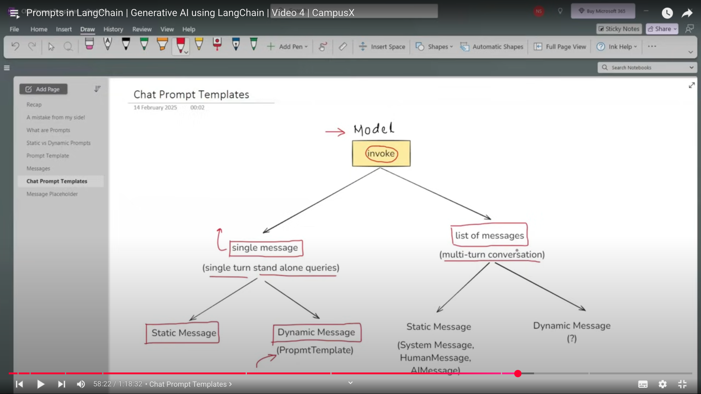

# Langchain

**### What is Langchain**

**It is an open-source framework used to connect various llms with each other in the form of chains.**

**There are other frameworks like Hatstack and LlamaIndex for the same purpose.**

**### Langchain Components**

**1. Models**

**2. Prompts**

**3. Chains**

**4. Memory**

**5. Indexes**

**6. Agents**

**### Models**

**These are the core interfaces used to interact with AI models.**

---

**```python**

**from langchain_openai import ChatOpenAI**

**from dotenv import load_dotenv()**

**load_dotenv()**

**model=ChatOpenAI(model='gpt4',temperature=0)**

**result= model.invoke("Hi, how are you")**

**print(result.content)**

**```**

**Models can be of different types like -> Language Model or Embedding Model**

**### Prompts**

**Inputs provided to LLM.**

**```python**

**# Dynamic & Reusable Prompts**

**from langchain_core.prompts import PromptTemplate**

**prompt=PromptTemplate('Summarize {topic} in {emotion} tone.')**

**print(prompt.format(topic='cricket',emotion='funny'))** ****

**# Role Based Prompts**

**from langchain_core.prompts import ChatPromptTemplate**

**chat_prompt= ChatPromptTemplate.from_template([**

**    ("system","You are an experienced engineer having job role of {role}. You have to answer all the queries correctly as an experienced person."),**

**    ("user","Please give me summary about {topic}"),**

**])**

**message=chat_prompt.format_messages(role='Devops Engineer',topic='CI/CD pipeline')**

**# Few Shot Prompting (In this we first show examples to our model)**

**#### Step-1**

**examples=[**

**    {"input","I was charged with pricehigher than mrp.","output","Billing Issue."},**

**    {"input","The app crashes everytime I click on feedback","output","Technical Issue."},**

**    {"input","Explain how to run the query","output","General Inquiry"}**

**]**

**#### Step-2**

**example_template= """**

**Ticket:{input}**

**Category:{output}**

**"""**

**#### Step-3**

**few_shot_prompt = FewShotPromptTemplate(**

**    examples=examples,**

**    example_prompt=PromptTemplate(input_variables=["input","output"],template=example_template),**

**    prefix="Classify the following customer tickets into one of the categories:'Billing Issue','Technical Issue' or 'General Inquiry'.\n\n",**

**    suffix="\nTicket: {user_input}\nCategory:",**

**    input_variables=["user_input"],**

**)**

**```**

**### Chains**

**It can be of 2 types**

**Parallel chaining ->** ****

**Conditional Chaining ->**

**### Indexes**

**Indexes connect your model with external knowledge - such as PDFs, websites and databases.**

**### Memory**

**LLM API calls are stateless so memory is used to keep the AI tell about prev chats**

***ConversationBufferMemory* -> Stores a transcript of recent messages. Gr8 for small chats but can grow large quickly.**

***ConversationBufferWindowMemory* -> Only keeps the last N interactions to avoid excessive token usage.**

***Summarizer-Based Memory* -> Periodically summarises the older chat segments** ****

***Custom Memory* -> For advanced use-cases**

**### Agents**

**Not only chatbot but also can work as an assistant or agent**

**### Prompt**

**Always make a prompt template so that it can help the ai model reduce its hallucinations because static prompts can make model hallucinate.**

### Why to use PromptTemplate when you can use f strings?

Because PromptTemplate has several advantages over fstring like:

1. Validate_template=True
2. Reusable code (You can save it as JSON and can use it in your code using load_prompt)
3. It works well with Langchain Ecosystem



### (For Dynamic Messages, use ChatPromptTemplate)

### Message Placeholder:

ChatPromptTemplate ke andar multiple messages insert krne ke liye use hota h

### Structured Output:

It is used to get the output in different formats such as JSON on anything else

USES:

1. API Building
2. Data Extraction
3. Building AI agents

### Why Runnables?

For LLM based applications, since we have many companies having different api calling code but by using runnables you can directly use all the types of api's with minimal code changes. Also some other things such as we need different phases when we are scanning a pdf like PDF load, PDF embedding, etc, so Langchain made different components as helper classes such as TextSplitters, OutputParsers, etc.

Runnables are like a unit of work like lego block you can say
